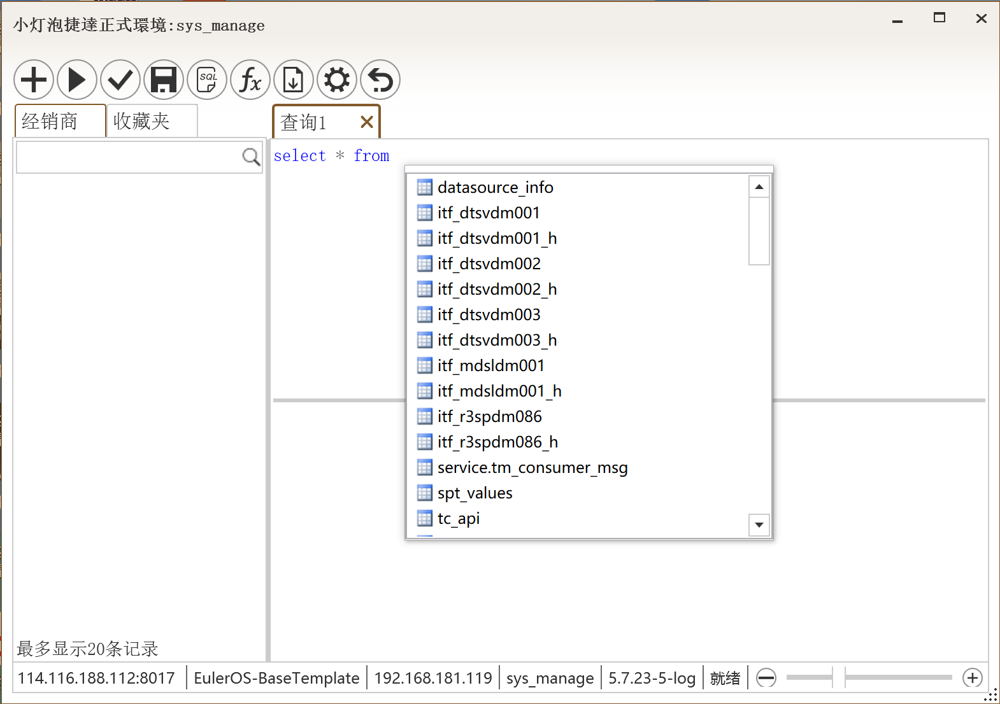

# 小灯泡的操作手册

> 小灯泡自从面世以来，一直没有一个像样的说明书。都靠大家的口口相传，大家才逐渐适应了小灯泡；希望通过这样一个资料，能帮助大家了解到小灯泡的全部功能；

小灯泡是一个现代的数据库连接工具。界面优雅，运行流畅。允许您连接到 SQLServer、MySQL、Oracle等数据库。

# 支持的数据库

目前，您可以使用 小灯泡 来处理：

- MySQL
- MS SQL Server 
- Oracle

# 下载和安装
## For Windows

- 下载链接: http://shanxik.cc/downloads/modern/5CCC4B2E6874D16D728192EF71F819DC.zip
- 要求: 
  - Windows 7 或更高系统
  - .NET 4.5 或更高

# 数据采集

小灯泡绝不会向我们的服务器发送或存储您的任何数据。所有数据库凭据都安全地保存在用户及数据库服务器的设备硬盘中。

小灯泡将用户的申请码信息存储在开发者位于中国长春虹馆的个人PC上，仅供许可证管理器使用。申请码与机器信息无关，它不包含有关用户设备的任何私人信息，只是一个序列号。

# 连接说明

与传统的数据库连接工具不同，小灯泡在直接连接数据库的基础上，还增加了连接到应用服务器的方式。在应用服务器中，小灯泡配置了鉴权管理、多库连接管理、缓存管理、日志管理、数据执行审查等重要功能。

