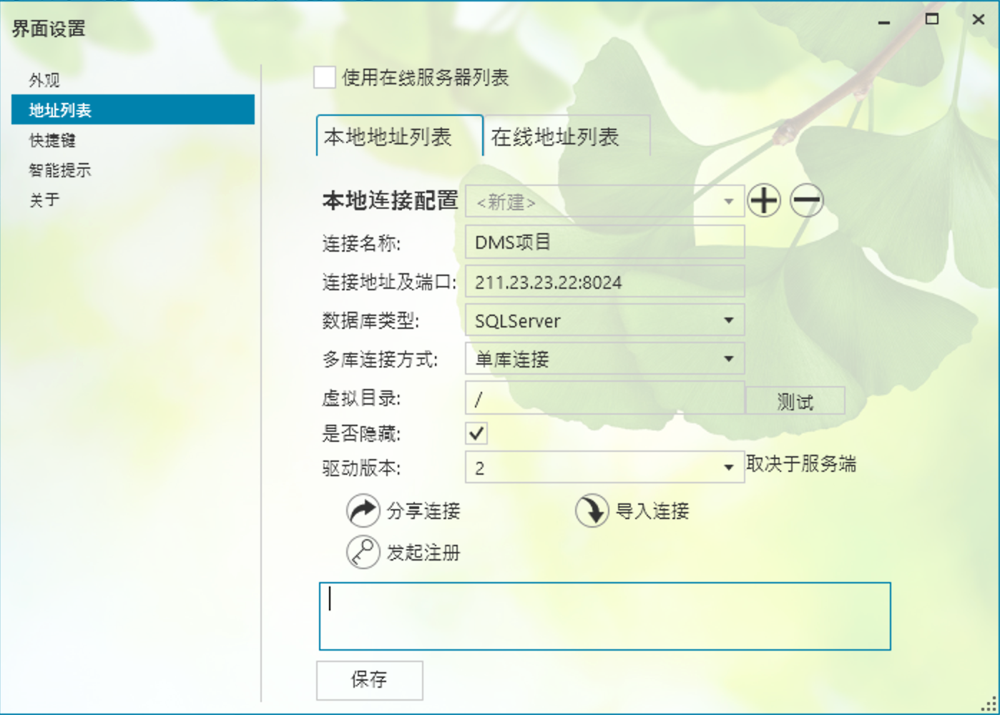
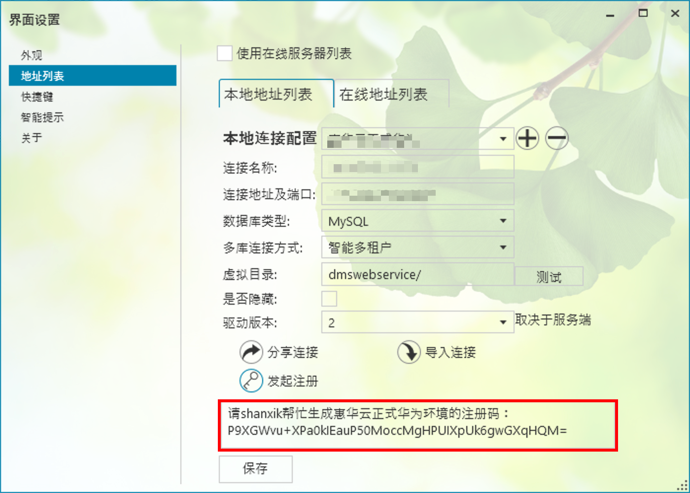

# 入门

## 1. 创建连接

> 小灯泡有两种连接方式。分别是「远程连接」与「直接连接」；

- 远程连接：
连接到项目所架设的小灯泡专用的应用服务器，应用服务器配置了鉴权管理、多库连接管理、缓存管理、日志管理、数据执行审查等重要功能。

- 直接连接：
以传统的用户名、密码、端口等信息连接到 MySQL、SQLServer、Oracle 数据库

## 2. 远程连接配置方式
### 快速复制
1. 找其他同事分享连接，例如：
   `light://aliasname=MEP项目PRD&url=211.23.23.22:8024&redirect=2&virtualfolder=dmswebservice/&DBType=MySQL&FunctionVersion=2`
2. 打开小灯泡，点击右上角的齿轮⚙️图标
3. 单击导入链接，在弹出的对话框中输入分享的连接
4. 单击「保存」，完成设置

### 手工设置
1. 打开小灯泡，点击右上角的齿轮⚙️图标
2. 根据图片的说明填入连接需要的信息；
   

>  **连接名称**: 填入项目名称。建议名称后面标识环境信息，PRD、UAT等等
>
>  **连接地址及端口**: 地址(或者域名):端口。如果不填入端口，这里默认80端口
>
>  **数据库类型**: 选择 Oracle、MySQL、SQLServer
>
>  **多库连接方式**: `单库连接`：后台的数据库只是一个；`普通多库`：后台的数据库是通过小灯泡的配置，实现的多库方式；`智能多库`：是适应 MEP、DMS 等使用多租户的方式开发的连接方式。
>  连接方式请咨询项目开发Leader
>
>  **虚拟目录**: 一般为空；建议填入/
>
>  **是否隐藏**: 一定要取消勾选
>
>  **驱动版本**: 默认是2，不做改动

3. 单击保存，完成设置

## 3. 注册
小灯泡对每个连接都需要注册，注册后可得到有限的日期授权、对数据库只读或者更新的授权；

1. 单击「发起注册」
   
2. 复制底下注册框中的字符，发给开发者 shanxik
3. 这个窗口别关，收到注册码之后，覆盖该输入框的内容
4. 单击「保存」，完成注册。